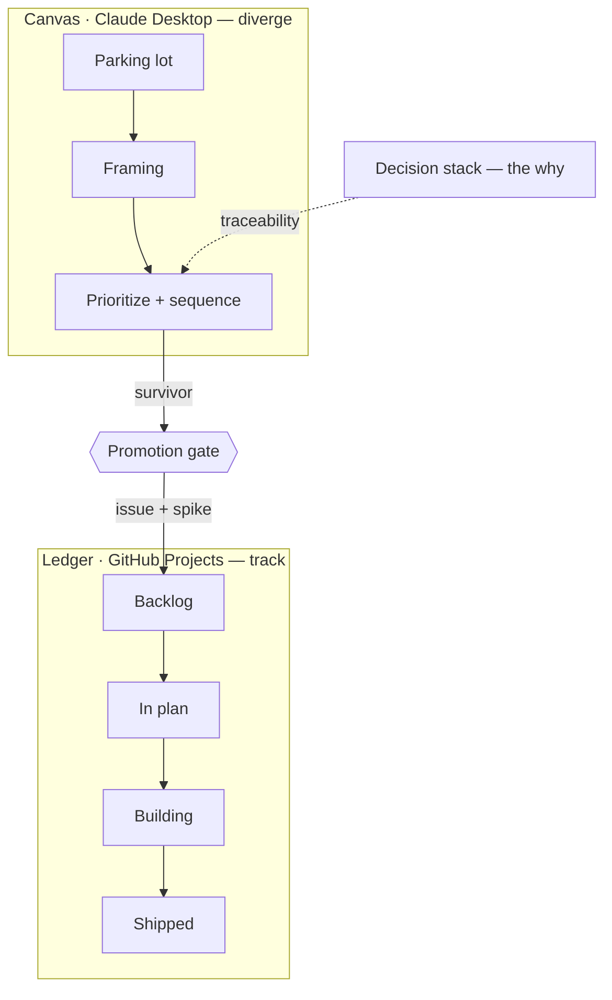
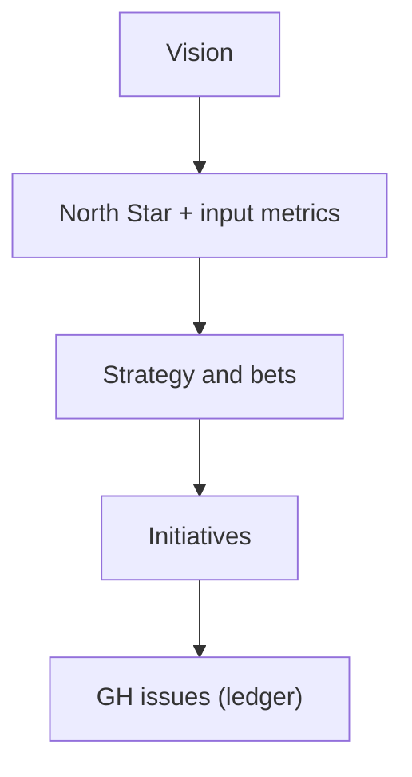

# Claude Diamonds

A method for running product decisions end to end with Claude, from a raw
idea to shipped code. Two diamonds, with one deliberate gate between them.

This repository explains the **process** and the **templates**. It does not
carry the enforcement machinery. That lives in the reference implementation,
[claude-code-workflows](https://github.com/azevedo-home-lab/claude-code-workflows)
(WFM), which this document cites rather than copies. You can read this and
understand the method without running WFM.

New to how Claude Code itself works? A short [learning site](https://azevedo-home-lab.github.io/Claude_Diamonds/) covers turns, the agentic loop, and loop patterns — background for this method, published separately from it.

## Why

Two different kinds of thinking get asked of one tool, and the tool fails at
one of them.

The divergent half — capture an idea, frame it as a problem, weigh it against
other problems, decide what comes first — wants a canvas. Ideas move, merge
and die there, and most never become work.

The convergent half — spec, plan, build, prove, ship — wants a ledger. Items
have identity, state and history.

A project board is a ledger. Asked to hold the divergent half, it demands
identity and state from ideas that have neither yet. So the framing either
never happens, or it happens in chat and is lost when the session ends. The
symptom is a repository whose decision records all start at "decided" — the
"why" is implicit, written after the direction was already chosen.

The fix is not a better board. It is two surfaces with a gate between them.

## What

Two diamonds. A canvas for divergence, a ledger for convergence, and one
human commit that separates them.

### The boundary contract

The operating rule, end to end:

| Layer | Surface | Does | Output |
|---|---|---|---|
| Front diamond | Claude Desktop | discover, frame, prioritize, sequence | vision and opportunity docs, plus a snapshot board |
| Promotion gate | the human, deliberately | the survivor crosses | an issue and a decision record |
| Back diamond | Claude Code | plan → spec → plan → judged build → ship | code, judged |
| Ledger | GitHub Projects | tracks only what crossed the gate | issues, and everything downstream |

Source of truth is always the repository — its docs and its `CLAUDE.md` —
never tool-to-tool sync.

The rule that falls out of this: **give the coding agent specs, not vision.**
Don't ask Claude Code for strategy, and don't ask the strategy surface to
debug. Ryan McDonald states the same boundary from the Cowork side. The
surfaces share a project folder and a `CLAUDE.md`, not a live pipe.
Overlapping their work is the failure mode to avoid.

## The front diamond — divergent

Three zones, and no more. Each has to earn its place.

| Zone | Purpose | Framework |
|---|---|---|
| **1. Parking lot** | Cheap capture of raw ideas. Nothing is committed by being here. | — |
| **2. Framing** | Raw idea becomes an opportunity: a problem plus the evidence for it. | Opportunity Solution Tree (Teresa Torres, *Continuous Discovery Habits*) |
| **3. Prioritize + sequence** | Impact against effort, then a Now / Next / Later view. | Impact-effort scoring; Now/Next/Later roadmaps (Janna Bastow, ProdPad) |

Two things people expect to see here are deliberately absent. A **funnel** is
not a zone — it is the motion between these three. **Sequence** is not a zone
either — it is a view of prioritization, which is why this is three zones and
not five.

### The decision stack

Running alongside the zones is the traceable why. It is John Cutler's Stack,
built on the North Star framework:

This is vertical traceability, and it is exactly what a project board cannot
show. Every issue traces up to a bet; every bet traces up to the strategy.
A board shows what is moving. The stack shows why any of it should move at
all.

### The canvas is a snapshot, not live state

Hand-author the board as committed HTML. State lives in the browser's
`localStorage`, so the committed file is a **starting arrangement, not a
system of record**. WFM's `docs/prioritization/` is the precedent and carries
the same caveat in its own README.

Do not build this on Claude Design. Design runs VM-isolated with a separate
localhost and has no automatic pipe from Desktop — you upload to it by hand.
That makes it a view and deck tool. Use it to author the *look* of a board
or a shareable vision deck. Do not let it hold the board's data. Marc Bara's
stack breakdown is the source for both constraints.

## The promotion gate — one deliberate human commit

Nothing on the canvas is real until it crosses.

The idea that survives becomes two things at once:

1. a **GitHub issue** — its identity in the ledger, and
2. a **decision record** citing the stack. WFM calls this a *spike*. It
   carries the issue it answers, its status and date, the decision, the
   evidence that forced it, the consequences, and what it does not change.

This step is manual on purpose. It is not automation deferred to later. The
research is explicit that Desktop-to-Code handoffs are manual uploads through
a shared folder, not live sync. A deliberate gate matches how the tools
actually behave. The gate is also where the
commitment happens: a canvas item costs nothing, and an issue costs
attention.

## The back diamond — convergent

Once through the gate, the work runs plan → spec → plan → judged build →
ship, on the coding surface.

What makes this half durable is not the prompt text. It is four things a
coding agent cannot supply for itself, which is why they are worth
externalizing as mechanism.

| Pillar | What it is | Why the model cannot do it alone |
|---|---|---|
| **Enforcement** | Deterministic hooks that deny tool calls outside the sanctioned paths | A prompt can be rationalized around; a blocked tool call cannot |
| **Structure** | Phases, PR and issue slots, required artifacts | Shape is imposed from outside the model |
| **Memory** | Issues, boards, cross-session observations | Sessions end; without an external record, decisions are lost |
| **Measurement** | A rule earns its place only against a recorded failure of the bare model, and is re-tested when the model changes | The model cannot know what it no longer needs to be told |

The four pillars, and the wording above, come from WFM's
[README](https://github.com/azevedo-home-lab/claude-code-workflows#goal) and
its positioning decision record,
[`docs/spikes/wfm-positioning.md`](https://github.com/azevedo-home-lab/claude-code-workflows/blob/main/docs/spikes/wfm-positioning.md).

### Why there are no personas in this method

The measurement pillar has a result that shapes the front diamond too.

WFM's eval harness ran three pressure tests, each under "tests pass, hurry
up" pressure. A planted security bug, a planted state bug, and a
boundary-testing task. The bare model, with no agent prompt and no workflow
framework, passed all three. Its conclusion: prompt text that teaches the
model what it already knows is not an asset. It is maintenance cost that
goes stale as models improve.

Persona and role-play prompt text specifically does not survive that test.
So the front diamond above uses **named lenses with required outputs** — an
angle plus the artifact it must produce — and never a role-played
personality. A lens that cannot name the output it produces has not earned
its place.

## How to run it

1. **Capture** into the parking lot. No commitment, no framing yet.
2. **Frame** the ones worth framing: the problem, and the evidence for it.
3. **Score and sequence** what survives framing — impact against effort,
   then Now / Next / Later.
4. **Check the stack.** If the item does not trace up to a bet, and the bet
   to the strategy, it is not ready to cross.
5. **Promote.** File the issue, write the decision record, cite the stack.
6. **Build in the back diamond**, judged, against the spec — not against the
   vision.

The board is republished as a snapshot when its arrangement changes. The
ledger carries state from there on.

## Scope

**In scope for this repository:** the method, the zones, the gate, the
boundary contract, and the templates that go with them.

**Out of scope:** hooks, judges, evals, and every other enforcement script.
Those belong to the reference implementation and are cited here rather than
duplicated. Two copies drift.

## References

The method is assembled from these, and they are worth reading directly.

**The surface boundary**

- Ryan McDonald, [The Orchestrator and the Dev](https://ryancmcdonald.com/blog/claude-cowork-and-claude-code-together/) — Cowork and Code together; the manual handoff through `CLAUDE.md`.
- iwoszapar, [Claude Code CLI vs Desktop](https://www.iwoszapar.com/p/claude-code-cli-vs-desktop) — the feature matrix behind "the work decides the surface".
- Marc Bara, [Claude Design is here — where does it fit in the stack](https://medium.com/@marc.bara.iniesta/claude-design-is-here-where-does-it-fit-in-the-stack-22d98c934970) — Design as a view; VM isolation and no automatic pipe.

**The product frameworks**

- Teresa Torres, *Continuous Discovery Habits* — the Opportunity Solution Tree.
- John Cutler, the Stack and the North Star framework — vision down to initiatives.
- Janna Bastow (ProdPad), Now / Next / Later roadmaps.

**The reference implementation**

- [claude-code-workflows](https://github.com/azevedo-home-lab/claude-code-workflows) — hooks, judges, evals, and the conventions the back diamond runs on.

## License

[GPL v3](LICENSE)
