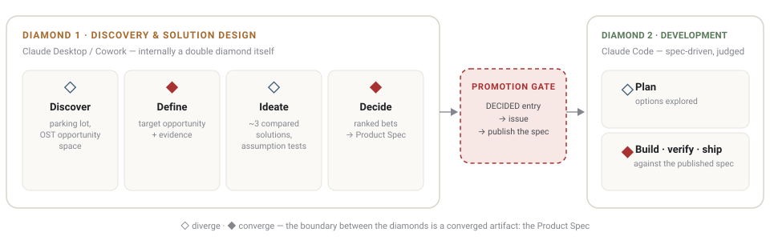

# Claude Diamonds

One repo, two jobs:

1. **Learn the product job.** A [learning hub](https://azevedo-home-lab.github.io/Claude_Diamonds/)
   that teaches the product methodologies any product person can use —
   and the Claude mechanics that make them runnable — each lesson built
   from verified primary sources.
2. **Run the product job.** The Claude Diamonds method: product
   decisions end to end with Claude, from raw idea to shipped code —
   producing each product's pre-gate artifacts and handing development
   to spec-driven workflows ([WFM](https://github.com/azevedo-home-lab/claude-code-workflows#goal)).

Both grow over time; the hub is the source of truth for what's built.

## 🎓 Learning hub — start here

**[azevedo-home-lab.github.io/Claude_Diamonds](https://azevedo-home-lab.github.io/Claude_Diamonds/)**

**Product Methodologies** — the theory of the product job:
[Decision Stack — Eriksson](https://azevedo-home-lab.github.io/Claude_Diamonds/decision-stack.html) ·
[Opportunity Solution Tree — Torres](https://azevedo-home-lab.github.io/Claude_Diamonds/ost.html) ·
[Prioritization — Cutler](https://azevedo-home-lab.github.io/Claude_Diamonds/cutler.html)

**Claude Aspects** — the mechanics underneath, for running the method
with Claude:
[Turns & loops](https://azevedo-home-lab.github.io/Claude_Diamonds/loops.html) ·
[Context & compaction](https://azevedo-home-lab.github.io/Claude_Diamonds/context.html) ·
[Hooks](https://azevedo-home-lab.github.io/Claude_Diamonds/hooks.html) ·
[Subagents](https://azevedo-home-lab.github.io/Claude_Diamonds/subagents.html)

Each methodology also has a canonical learning doc in
[`docs/methods/`](docs/methods/), with a compact `.claude.md` operating
file beside it — the files that bind Claude in product sessions.

## 🛠 The method — running real product work

Two diamonds, each diverging then converging, with one deliberate human
gate between them: **Discovery & Solution Design** (Claude Desktop /
Cowork) ends in a Product Spec; **Development** (Claude Code) turns that
spec into judged, shipped code. Ideas live on a canvas where they move,
merge, and mostly die; committed work lives in a ledger with identity
and history. Asking one surface to hold both is the failure this method
exists to prevent.

The method in three views:
[Two diamonds, one gate](https://azevedo-home-lab.github.io/Claude_Diamonds/method.html) ·
[How to run it](https://azevedo-home-lab.github.io/Claude_Diamonds/method.html#run) —
capture → frame → design → rank → promote → develop ·
[The repo contract](https://azevedo-home-lab.github.io/Claude_Diamonds/method.html#contract) —
each product repo carries `/product` (canvas + append-only decision
memory) and `/plan` (the published spec, Claude Code's only source of
product intent); one-way publish at the gate, `spec-change` issue as the
only channel back. Full text:
[`docs/repo-contract.md`](docs/repo-contract.md). Product artifacts live
in each product's repo — never here.

**Install it:** [`docs/templates/`](docs/templates/) holds the two
canonical paste blocks that bind a workspace to the method — the
[Desktop project instructions](docs/templates/claude-desktop-project-instructions-front-diamond.md)
for a front-diamond project (diamond 1), and the
[product-repo rules](docs/templates/claude-code-product-repo-rules.md)
for each product's CLAUDE.md (diamond 2). The repo file is always
canonical: when a template changes, every pasted snapshot must be
re-pasted; if they drift, the repo file wins.

## 🗺 Repo map

- [`docs/methods/`](docs/methods/) — canonical learning docs + `.claude.md` operating files.
- [`docs/templates/`](docs/templates/) — the two canonical paste blocks that install the method (see **Install it** above); snapshots are re-pasted on change, the repo file wins on drift.
- [`docs/specs/`](docs/specs/) — dated candidate specs: how this method changes, closed on merge.
- [`docs/repo-contract.md`](docs/repo-contract.md) — the /product · /plan contract.
- [`docs/canvas-snapshot.md`](docs/canvas-snapshot.md) — board-as-snapshot guidance.
- [`docs-site/`](docs-site/) — the learning hub and method pages, published via GitHub Pages.
- [`CLAUDE.md`](CLAUDE.md) — working rules for this repo (PR-based, mandatory).

Out of scope: enforcement machinery — hooks, judges, evals live in
[claude-code-workflows](https://github.com/azevedo-home-lab/claude-code-workflows)
and are cited, never duplicated.

## 📚 Sources

The primary sources every lesson restates — each verified live on its
lesson page; the originals are canonical and update ahead of this repo.

- **Double Diamond** — Design Council, [Framework for Innovation](https://www.designcouncil.org.uk/resources/framework-for-innovation/)
- **Decision Stack** — Martin Eriksson, [What is the Decision Stack?](https://www.thedecisionstack.com/what-is-the-decision-stack/) · [Mind the Product talk](https://www.mindtheproduct.com/the-product-decision-stack-martin-eriksson/) · *The Decision Stack* (book)
- **Opportunity Solution Tree** — Teresa Torres, [Product Talk — OST](https://www.producttalk.org/opportunity-solution-trees/) · [Assumption Testing](https://www.producttalk.org/assumption-testing/) · *Continuous Discovery Habits* (2021)
- **Prioritization** — John Cutler, [TBM 399 — 10 Prioritization Traps](https://cutlefish.substack.com/p/tbm-399-10-prioritization-traps) · [TBM 230 — From Prioritization to Accountability](https://cutlefish.substack.com/p/tbm-230-from-prioritization-to-accountability)
- **Spec-driven development** — [claude-code-workflows (WFM)](https://github.com/azevedo-home-lab/claude-code-workflows#goal)
- **Claude mechanics** — Anthropic documentation:
  - [How Claude Code works](https://code.claude.com/docs/en/how-claude-code-works) — turns and the loop (Turns & loops, Context lessons)
  - [The agentic loop — Agent SDK](https://code.claude.com/docs/en/agent-sdk/agent-loop) — context window, compaction (Turns & loops, Context lessons)
  - [Getting started with loops](https://claude.com/blog/getting-started-with-loops) — loop patterns (Turns & loops lesson)
  - [Features overview](https://code.claude.com/docs/en/features-overview) — context costs (Context lesson)
  - [Hooks](https://code.claude.com/docs/en/hooks) — (Hooks lesson)
  - [Subagents](https://code.claude.com/docs/en/sub-agents) — (Subagents lesson)
