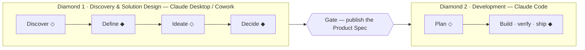

# Claude Diamonds

A method for running product decisions end to end with Claude, from raw
idea to shipped code. Two diamonds, each diverging then converging, with
one deliberate human gate between them: **Discovery & Solution Design**
(Claude Desktop / Cowork) ends in a Product Spec; **Development**
(Claude Code) turns that spec into judged, shipped code. Ideas live on a
canvas where they move, merge, and mostly die; committed work lives in a
ledger with identity and history. Asking one surface to hold both is the
failure this method exists to prevent.

◇ diverge · ◆ converge. The learning companion site is at
[azevedo-home-lab.github.io/Claude_Diamonds](https://azevedo-home-lab.github.io/Claude_Diamonds/) —
its [Method page](https://azevedo-home-lab.github.io/Claude_Diamonds/method.html)
is the visual version of this README.

## Foundations

Each foundation has a learning doc in [`docs/methods/`](docs/methods/)
(for humans) and a compact `.claude.md` operating file (what binds Claude).

### Double Diamond — Design Council (2004)

The shape. Both diamonds diverge then converge; the boundary between them
is a *converged artifact*, never a switch from divergent to convergent
thinking. Diamond 1 here is internally a double diamond itself — problem
(discover → define) then solution design (ideate → decide) — ending in the
Product Spec. [Framework for Innovation](https://www.designcouncil.org.uk/resources/framework-for-innovation/) ·
[spec 8](docs/specs/2026-08-14-8-double-diamond-clarification.md).

### The Decision Stack — Martin Eriksson

The vertical *why*. Vision → Strategy → Objectives (outcomes, not
outputs) → Opportunities → Principles; the how/why test walks any item up
the stack, and the first link that can't be said in one sentence is the
missing work. [thedecisionstack.com](https://www.thedecisionstack.com/what-is-the-decision-stack/) ·
[learning doc](docs/methods/decision-stack.md).

### Continuous Discovery & the Opportunity Solution Tree — Teresa Torres

The problem diamond and the divergent half of solution design: outcome →
evidence-backed opportunities → ~3 compared solutions → assumption tests.
Opportunities are evidenced, never invented; effort never selects a
target. [producttalk.org](https://www.producttalk.org/opportunity-solution-trees/) ·
[learning doc](docs/methods/opportunity-solution-tree.md).

### Prioritization — John Cutler

Diamond 1's convergence. Force-ranked 1-N bets — value vs urgency,
opportunity cost, cost of delay — never scored buckets; ten named traps
check the ranking. [TBM 399](https://cutlefish.substack.com/p/tbm-399-10-prioritization-traps) ·
[learning doc](docs/methods/cutler-prioritization.md).

### Spec-driven development, measured — WFM

Diamond 2 runs against the published spec with deterministic enforcement
(hooks, judges, evals) that must *earn its place* against a recorded
failure of the bare model — which is also why this method uses named
lenses with required outputs, never personas.
[claude-code-workflows](https://github.com/azevedo-home-lab/claude-code-workflows#goal).

## How to run it

1. **Capture** into the parking lot — no commitment, no framing.
2. **Frame**: opportunity + evidence on the product's OST.
3. **Design**: ~3 compared solutions, riskiest assumptions tested cheaply.
4. **Rank**: force-ranked bets; check the stack — no trace up, no crossing.
5. **Promote**: DECIDED log entry → GitHub issue → publish the spec into
   `/plan`.
6. **Develop** against the published spec, judged — never against the
   vision.

## The repo contract

Each product repo carries both diamonds: `/product` (canvas + append-only
decision memory, diamond 1 only), `/plan` (the published spec and stack,
Claude Code's only source of product intent), and implementation. One-way
publish at the gate; a `spec-change` issue is the only channel back.
Full contract: [`docs/repo-contract.md`](docs/repo-contract.md).

## Repo map and scope

[`docs/methods/`](docs/methods/) foundations (human + claude files) ·
[`docs/templates/`](docs/templates/) canonical paste blocks for the
Desktop project and product-repo CLAUDE.md ·
[`docs/specs/`](docs/specs/) dated candidate specs — how this method
changes · [`docs/repo-contract.md`](docs/repo-contract.md) ·
[`docs/canvas-snapshot.md`](docs/canvas-snapshot.md) board-as-snapshot
guidance · [`CLAUDE.md`](CLAUDE.md) working rules (PR-based, mandatory).

In scope: the method, the zones, the gate, the contract, the templates.
Out of scope: enforcement machinery — hooks, judges, evals live in
[claude-code-workflows](https://github.com/azevedo-home-lab/claude-code-workflows)
and are cited, never duplicated.
