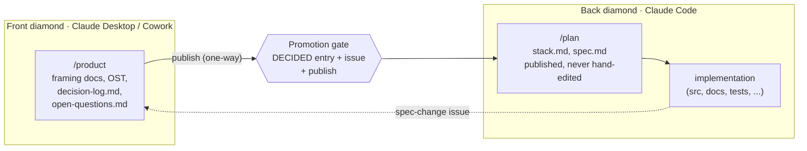

# The product repo contract — /product, /plan, and the publish

Status: DECIDED 2026-08-14 (Pedro, front-diamond session; supersedes the
"private product-work repo" and "GDrive folder as per-product store"
variants — both were challenged and retired in the same session).

Each product repo carries both diamonds, separated by a one-way publish.
This document is the contract between the two surfaces. The front-diamond
project instructions bind the Desktop/Cowork side; the paste block in
`templates/claude-code-product-repo-rules.md` binds the Claude Code side.

## The three territories

- **/product** — the canvas and the memory. Framing docs, the product's
  Opportunity Solution Tree, `decisions/decision-log.md` (append-only),
  `decisions/open-questions.md`. Canonical for **why**. Only front-diamond
  sessions read or write here. Products earn this folder (and the repo,
  if new) when they enter Framing; before that they are a parking-lot
  line in the portfolio project, nothing more.
- **/plan** — the published canon of **what is decided**. Contains only
  artifacts written at a gate crossing: `stack.md` (vision, strategy,
  current ranked bets — the decided stack) and one `spec.md` per promoted
  item (`/plan/<issue-id>/spec.md`). This is Claude Code's staging area
  and its only source of product intent.
- **Everything else** — implementation, owned by the back diamond.
  Its internal structure is out of scope for this contract.

## The publish (deliberately lightweight)

Publishing is a session action at the gate, not tooling. When Pedro
confirms a decision as DECIDED, the same session, in order:

1. Appends the DECIDED entry to `/product/decisions/decision-log.md`
   (already the end ritual).
2. Files the GitHub issue (already the gate).
3. Writes the published artifact into `/plan`: the spec for a promoted
   item, and — only if the decision changed vision, strategy, or the bet
   ranking — rewrites `stack.md`.

Every published file opens with a two-line header:
`Published from /product · D-xxx · <date>` and
`Do not hand-edit. Changes route through a spec-change issue.`

Publish, not copy: `/plan` files are derived and regenerable; `/product`
keeps the reasoning. If a `/plan` file and the decision log disagree, the
log is truth and the file is stale — republish it. No generator, no sync
tooling, no other artifacts in /plan. If gate frequency ever makes the
manual publish burdensome, that is the evidence required (YAGNI) to
consider automating it — not before.

## The two sides of the contract

**Front diamond (Claude Desktop / Cowork)** reads and writes `/product`;
writes `/plan` only at a gate crossing; never touches implementation.
Start ritual (in addition to reading the decision log and open
questions): check the product's open **spec-change** issues — they are
the back diamond's only channel for pushing work back.

**Back diamond (Claude Code)** reads `/plan` and implementation; treats
`spec.md` as binding and `stack.md` as context. It never reads
`/product` — not as background, not when stuck — and never edits
`/plan`. When implementation shows a spec is wrong, it files an issue
labeled `spec-change` stating what broke and why, then either continues
under the current spec or STOPs if blocked. An accepted spec change is a
new decision-log entry in `/product`, then a republish — the loop always
closes through the front diamond.

The `/product` blindfold should be mechanical where possible (Claude
Code permission deny rules or a WFM hook), not merely textual. That
enforcement belongs to the reference implementation (WFM); this method
states only the boundary.

## Portfolio level

Cross-product material — the shared parking lot, portfolio
prioritization snapshots — stays in the front-diamond Desktop project
(knowledge docs / connected folder). It is the only genuinely
multi-product surface; everything per-product lives in that product's
repo under this contract.
